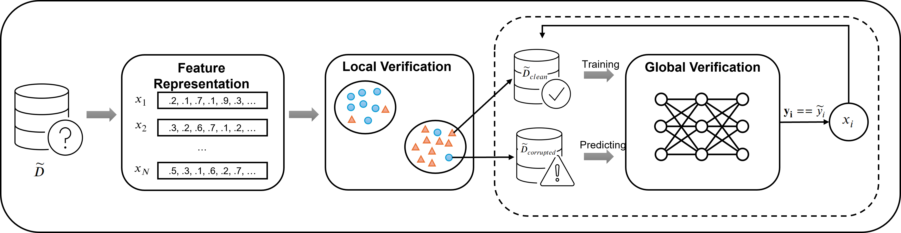

<div align="center">

# COLA: Leveraging Local and Global Relationships for Corrupted Label Detection
[](https://opensource.org/licenses/MIT) [](https://www.python.org/downloads/release/python-380/) 
[](https://www.sciencedirect.com/science/article/abs/pii/S0167739X2500024X#:~:text=In%20this%20paper%2C%20we%20introduce%20Cola%2C%20a%20novel,comprehensive%20and%20robust%20solution%20to%20corrupted%20label%20detection.)
</div>


## Introduction
COLA is a powerful, data-centric tool that detects and eliminates corrupted labels in real-world datasets. Leveraging both local neighborhood similarities and global relationships across the entire dataset, COLA identifies noisy labels that can significantly reduce model accuracy, especially in Machine Learning and Deep Learning models.

## The Architecture



The figure illustrates the COLA approach, which consists of three main components: **Feature Representation**, **Local Verification**, and **Global Verification**. First, data instances are encoded using an embedding method to represent their features. In the Local Verification phase, the 𝑘-Nearest Neighbors (𝑘-NN) algorithm is employed to determine the data labels based on their neighbors. Then, in the Global Verification phase, a classification model is trained on the "clean" data confirmed from the previous phase to capture general patterns and predict the remaining labels. This process can be iterated to improve accuracy.

## Quick Start
### Prerequisites
```bash
$ python3 -m venv cola
$ source cola/bin/activate
$ pip install -r requirements.txt
```
### Running the Script

#### Ag News
```bash
$ python3 main.py --data_type text --dataset_name ag_news --noise_type sym --error_rate 0.05 --encode_model bert-base-uncased
```

#### DBpedia
```bash
$ python3 main.py --data_type text --dataset_name jxm/dbpedia --noise_type sym --error_rate 0.05 --encode_model bert-base-uncased
```

#### Cifar10
```bash
$ python3 main.py --data_type image --dataset_name cifar10 --noise_type sym --error_rate 0.05 --encode_model facebook/dinov2-base
```

#### Cifar100
```bash
$ python3 main.py --data_type image --dataset_name cifar100 --noise_type sym --error_rate 0.05 --encode_model facebook/dinov2-base
```

We recommend using dinov2-base for better performance; however, for reproducing experiment results, you can also download the data embedded by CLIP ViT-B/32 [here](https://drive.google.com/drive/folders/1b6U_x3NzdXa7tc23CkN5aEMdHS44kVhX?usp=sharing)

## Citation
If you're using Cola in your research or applications, please consider citing our paper:
```
@article{LAM2025107729,
title = {Leveraging local and global relationships for corrupted label detection},
journal = {Future Generation Computer Systems},
volume = {166},
pages = {107729},
year = {2025},
issn = {0167-739X},
doi = {https://doi.org/10.1016/j.future.2025.107729},
url = {https://www.sciencedirect.com/science/article/pii/S0167739X2500024X},
author = {Phong Lam and Ha-Linh Nguyen and Xuan-Truc Dao Dang and Van-Son Tran and Minh-Duc Le and Thu-Trang Nguyen and Son Nguyen and Hieu Dinh Vo},
keywords = {Corrupted label, Corrupted label detection, Noisy data, Data cleaning, Data quality assurance},
abstract = {The performance of the Machine learning and Deep learning models heavily depends on the quality and quantity of the training data. However, real-world datasets often contain a considerable percentage of noisy labels, ranging from 8.0% to 38.5%. This could significantly reduce model accuracy. To address the problem of corrupted labels, we propose Cola, a novel data-centric approach that leverages both local neighborhood similarities and global relationships across the entire dataset to detect corrupted labels. The main idea of our approach is that similar instances tend to share the same label, and the relationship between clean data can be learned and utilized to distinguish the correct and corrupted labels. Our experiments on four well-established datasets of image and text demonstrate that Cola consistently outperforms state-of-the-art approaches, achieving improvements of 8% to 21% in F1-score for identifying corrupted labels across various noise types and rates. For visual data, Cola achieves improvements of up to 80% in F1-score, while for textual data, the average improvement reaches about 17% with a maximum of 91%. Furthermore, Cola is significantly more effective and efficient in detecting corrupted labels than advanced large language models, such as Llama3, with improvements of up to 112% in Precision and a 300X reduction in execution time.}
}
```

## Contact us
If you have any questions, comments, or suggestions, please do not hesitate to contact us.
- Email: 22028164@vnu.edu.vn
